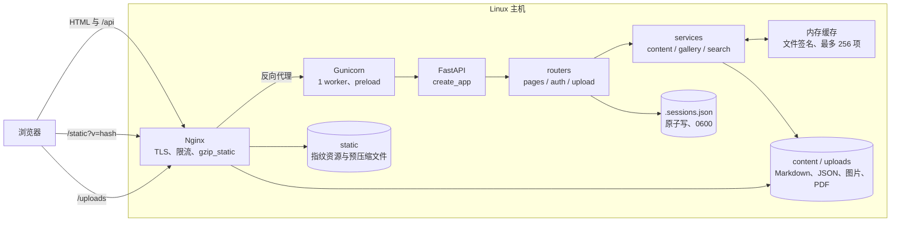
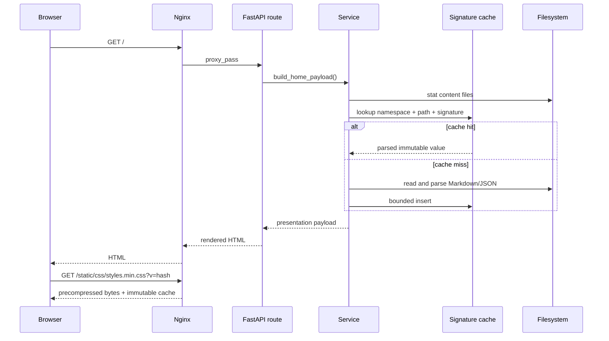
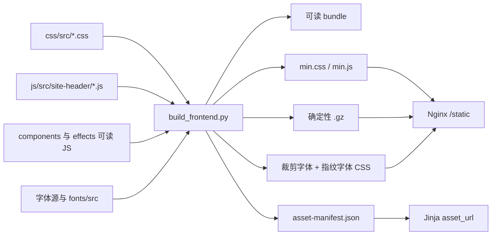

# 架构与数据流

## 运行时拓扑

边界非常明确：Nginx 处理网络、静态传输和缓存头；FastAPI 只处理动态 HTML/JSON 与管理写操作；内容本身保存在文件系统，没有数据库。

## 应用分层

| 层 | 位置 | 职责 |
| --- | --- | --- |
| 应用装配 | `app/main.py` | 创建 FastAPI、挂载本地静态目录、注册异常处理和路由 |
| HTTP 边界 | `app/routers/` | 参数、认证、响应类型和缓存头 |
| 展示服务 | `app/services/` | 组合首页、论文、Gallery 和搜索 payload |
| 领域工具 | `app/daily*.py`、`gallery_*.py`、`markdown_utils.py` | 解析、缩略图、Daily 与文件操作 |
| 基础设施 | `app/cache.py`、`auth.py`、`assets.py` | 缓存、会话、凭据和资源 URL |
| 视图 | `app/templates/` | 服务端 Jinja HTML；不承担数据扫描 |

路由中保留少量 URL 与 HTTP 语义，文件扫描和数据组合放入 service。这样单元测试可以直接验证缓存失效，而无需启动浏览器或真实服务器。

## 一次页面请求

缓存签名为文件的 `mtime_ns + size`；外部编辑文件后，下一个请求自动重建。缓存最多 256 项并使用单飞锁，防止冷启动并发重复解析。返回给请求的 Gallery/JSON 数据会复制，调用方不能污染缓存对象。

## 前端构建流

构建器保持请求模型稳定：全站仍只加载一个主 CSS 和一个 header 脚本；模块化发生在源码层，不把大量小模块推给浏览器。

## 状态与一致性

- `content/`：公开内容和 Daily 快照。读取缓存按签名自动失效。
- `uploads/`：可变二进制与相册 `meta.json`。删除、重命名、写元数据均经过安全路径拼接和原子写。
- `gallery_config.json`：public/private/hidden 状态。写操作有进程内锁和原子替换。
- `.sessions.json`：单 worker 会话存储。文件为 0600，写入先 fsync 临时文件再 `os.replace`。
- `static/`：发布产物。运行期间只读，URL 由构建清单决定。

当前设计刻意使用一个 Gunicorn worker：文件会话和进程内缓存不需要跨进程协调，内存占用也更低。若未来扩展到多 worker，必须先把会话迁移到共享存储，并接受每个 worker 各自维护内容缓存。

## 安全边界

- 不存在内置上传密码；哈希为空时认证失败。
- bcrypt 校验、HttpOnly/SameSite Cookie、HTTPS Secure Cookie 和登录限流共同保护后台。
- `safe_join()` 阻止上传、删除、相册路径穿越。
- Nginx 对动态请求限流；静态请求不占 FastAPI worker。
- `.env`、生产上传、会话文件不进入 Git。

部署拓扑和配置位置见 [DEPLOYMENT.md](DEPLOYMENT.md)，日常备份与恢复见 [OPERATIONS.md](OPERATIONS.md)。
