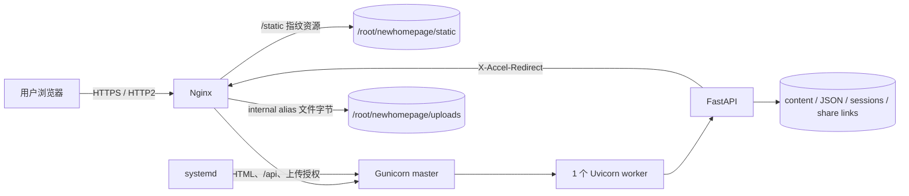

# 生产部署与回滚

本文以当前生产路径 `/root/newhomepage`、服务 `foreverhyx-homepage` 和域名 `foreverhyx.top` 为例。参考环境是 Debian/Linux、Nginx、systemd、Python 3.11。

## 部署拓扑



Nginx 直接服务静态文件。上传 URL 先经过 FastAPI 的公开/登录/token 判定，再用 `X-Accel-Redirect` 交回 Nginx internal alias，因此 Python worker 不传输文件主体。动态页面由一个预加载 worker 服务，以减少重复内存并保持文件会话模型一致。

## 前置条件

- DNS 已指向服务器。
- `/etc/letsencrypt/live/foreverhyx.top/` 已有证书；首次部署可先用 Certbot 获取。
- 服务器已安装 `python3-venv`、Nginx、Git。
- GitHub deploy key 或 SSH key 可读取仓库。
- `.env` 中有真实 bcrypt 哈希；绝不使用示例占位符。

## 首次安装

```bash
cd /root
git clone git@github.com:ForeverHYX/Homepage.git newhomepage
cd /root/newhomepage
python3 -m venv .venv
.venv/bin/pip install --upgrade pip
.venv/bin/pip install -r requirements.txt
cp .env.example .env
.venv/bin/python scripts/hash_password.py
```

把生成结果写入 `.env`，同时确认：

```env
HOMEPAGE_UPLOAD_USER=<非默认用户名>
HOMEPAGE_UPLOAD_PASS_HASH=<bcrypt hash>
HOMEPAGE_COOKIE_SECURE=true
HOMEPAGE_CONTENT_DIR=/root/newhomepage/content
HOMEPAGE_UPLOAD_DIR=/root/newhomepage/uploads
HOMEPAGE_SHARE_LINK_FILE=/root/newhomepage/.share-links.json
HOMEPAGE_USE_X_ACCEL_REDIRECT=true
HOMEPAGE_ENABLE_API_DOCS=false
```

生成资源已提交到 Git，生产虚拟环境只需 `requirements.txt`。如选择在服务器构建，则额外安装 `requirements-dev.txt` 并运行 `make build`。

安装配置：

```bash
install -m 0644 deploy/foreverhyx-homepage.service \
  /etc/systemd/system/foreverhyx-homepage.service
install -m 0644 deploy/nginx-foreverhyx.conf \
  /etc/nginx/sites-available/foreverhyx-homepage
ln -sfn /etc/nginx/sites-available/foreverhyx-homepage \
  /etc/nginx/sites-enabled/foreverhyx-homepage
.venv/bin/python scripts/doctor.py --production
nginx -t
systemctl daemon-reload
systemctl enable --now foreverhyx-homepage
systemctl reload nginx
```

`deploy/nginx-foreverhyx.conf` 顶部包含 `map` 和限流 zone，必须在 Nginx `http` 上下文中 include（标准 `sites-enabled/*` 正是这个位置），不能放进另一个 `server {}`。

## 每次发布前

在开发机完成：

```bash
make build
make check
git diff --check
git status --short
git push origin main
```

构建产物必须和源码同一提交。不要在生产服务器一边运行旧进程一边重建资源后长期不 reload：应用进程会缓存旧 manifest，HTML 可能短暂引用旧 hash。

## 安全更新流程

### 1. 记录当前版本并备份数据

```bash
cd /root/newhomepage
git rev-parse HEAD
install -d -m 0700 /root/homepage-backups
tar -C /root/newhomepage -czf \
  /root/homepage-backups/homepage-data-$(date -u +%Y%m%dT%H%M%SZ).tar.gz \
  .env .sessions.json .share-links.json content uploads gallery_config.json
```

首次还没有分享链接时可先创建 `0600` 的 `{"version":1,"links":{}}` 文件。备份只放在 0700 目录；其中包含密码哈希、会话、分享 token 和私人相册，不应上传到公共对象存储。

### 2. 快进更新和依赖

```bash
git fetch origin
git status --short
git pull --ff-only origin main
.venv/bin/pip install -r requirements.txt
.venv/bin/python scripts/doctor.py --production
```

若 `git status` 出现受跟踪文件修改，先查明来源，禁止用强制 reset 覆盖生产内容。被忽略的 `.env`、uploads、Gallery 配置和会话不会被 `git pull` 删除。

### 3. 验证配置再切换

```bash
install -m 0644 deploy/foreverhyx-homepage.service \
  /etc/systemd/system/foreverhyx-homepage.service
install -m 0644 deploy/nginx-foreverhyx.conf \
  /etc/nginx/sites-available/foreverhyx-homepage
systemctl daemon-reload
nginx -t
systemctl restart foreverhyx-homepage
systemctl reload nginx
```

仅代码变化且 unit 没变时可用 `systemctl reload foreverhyx-homepage`，Gunicorn 会优雅替换 worker。unit、依赖或环境发生变化时使用 restart；`graceful-timeout=30` 和 `SIGTERM` 会给在途请求完成时间。当前 Gunicorn/Uvicorn 组合已验证可在约 0.4 秒完成空闲服务的 application shutdown；不要把 systemd `KillSignal` 改成 `SIGQUIT`。

### 4. 健康检查

```bash
systemctl is-active foreverhyx-homepage nginx
curl -fsS -o /dev/null -w '%{http_code} %{time_total}\n' \
  https://foreverhyx.top/
curl -fsS https://foreverhyx.top/api/search-index >/dev/null
curl -fsS https://foreverhyx.top/gallery >/dev/null
test "$(curl -sS -o /dev/null -w '%{http_code}' https://foreverhyx.top/upload)" = 303
test "$(curl -sS -o /dev/null -w '%{http_code}' https://foreverhyx.top/docs)" = 404
journalctl -u foreverhyx-homepage -n 50 --no-pager
```

FastAPI 当前只为页面声明 GET，根路径 `curl -I` 会返回 405；健康检查必须实际 GET。

继续验证缓存和压缩：

```bash
curl --compressed -sS -D - -o /dev/null \
  'https://foreverhyx.top/static/css/styles.min.css?v=<manifest 中的 hash>'
curl -sS -D - -o /dev/null \
  'https://foreverhyx.top/uploads/avatar.png'
```

指纹静态资源应有 `max-age=31536000, immutable` 和 `Content-Encoding: gzip`（文本资源）；无指纹 `/static/` 应为 300 秒；公开 uploads 应为 3600 秒且不是 immutable。另需确认一个 private/hidden 文件普通 URL 匿名返回 404，而已创建的 `/share/<token>` 返回 200 并支持 Range。

## 回滚

代码回滚不触碰数据目录：

```bash
cd /root/newhomepage
git switch --detach <previous-known-good-commit>
.venv/bin/pip install -r requirements.txt
install -m 0644 deploy/foreverhyx-homepage.service \
  /etc/systemd/system/foreverhyx-homepage.service
install -m 0644 deploy/nginx-foreverhyx.conf \
  /etc/nginx/sites-available/foreverhyx-homepage
systemctl daemon-reload
nginx -t
systemctl restart foreverhyx-homepage
systemctl reload nginx
```

恢复后完成线上检查。问题修复并推送到 `main` 后，用 `git switch main && git pull --ff-only` 回到正常发布轨道。

如果需要恢复内容，先停止写入管理后台，然后从备份一起恢复 `content/`、`uploads/`、`gallery_config.json` 和 `.share-links.json`，否则历史分享 URL 会失效；不要默认恢复旧 `.sessions.json`，让现有登录失效更安全。

## 权限

- `/root/newhomepage/.env`：建议 0600。
- `.sessions.json`：应用自动写为 0600。
- `.share-links.json`：应用自动原子写为 0600，必须和 uploads 同步备份。
- Nginx worker 必须能读取 `static/`、`uploads/` 及其父目录。
- 缩略图目录和文件会被应用修复为可供 Nginx 读取的 0755/0644。
- systemd unit 使用 `NoNewPrivileges` 与 `PrivateTmp`，但仍以当前部署用户访问项目数据。

更多日志、资源和备份检查见 [OPERATIONS.md](OPERATIONS.md)。
